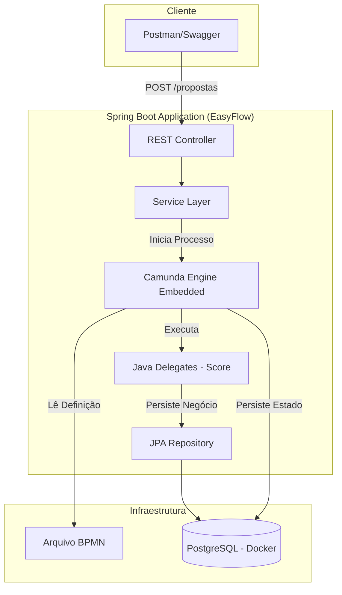
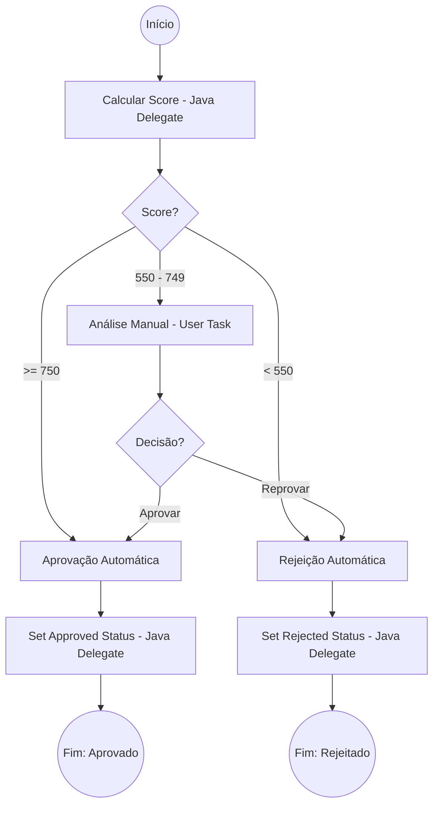

# EasyFlow - Credit Approval Service

O **EasyFlow** é um sistema de orquestração de propostas de crédito desenvolvido para demonstrar a integração robusta entre **Java (Spring Boot)** e **Camunda BPM 7**. O projeto automatiza decisões de crédito baseadas em score, combinando regras automáticas e análise humana.

## Visão Geral do Processo
O fluxo de negócio foi modelado em **BPMN 2.0** e segue a seguinte lógica:
1.  **Início**: Uma proposta é recebida via API.
2.  **Cálculo de Score**: Um `Java Delegate` processa idade, renda e valor solicitado para gerar um score de 0 a 1000.
3.  **Decisão Automática (Gateway)**:
    *   **Score >= 750**: Aprovação Automática.
    *   **Score < 550**: Rejeição Automática.
    *   **Score entre 550 e 749**: Encaminhado para **Análise Manual** (User Task).
4.  **Persistência**: O status final (`APPROVED` ou `REJECTED`) é persistido no banco de dados via Service Tasks.

## Tecnologias Utilizadas
- **Java 21** & **Spring Boot 3.5.9**
- **Camunda BPM 7** (Embedded Engine)
- **PostgreSQL** (Persistência de Negócio e Engine)
- **Docker** (Containerização do Banco de Dados)
- **MapStruct** (Mapeamento de DTOs)
- **SpringDoc OpenAPI (Swagger)** (Documentação da API)
- **Lombok** (Produtividade)

## Arquitetura do Sistema


## Arquitetura do Fluxo BPMN



## Como Executar

### 1. Pré-requisitos
- Docker e Docker Compose instalados.
- JDK 21.

### 2. Subir o Banco de Dados
```bash
docker-compose up -d
```

### 3. Rodar a Aplicação
```bash
./mvnw spring-boot:run
```

## Documentação e Monitoramento
- **Swagger UI**: [http://localhost:8080/swagger-ui.html](http://localhost:8080/swagger-ui.html)
    - *Utilize para testar os endpoints de criação de proposta e conclusão de tarefas.*
- **Camunda Cockpit**: [http://localhost:8080/camunda/app/cockpit/](http://localhost:8080/camunda/app/cockpit/)
    - *Login: admin / admin*
    - *Visualize as instâncias de processo em tempo real.*

## Endpoints Principais
- `POST /credit-proposals`: Submete uma nova proposta.
- `GET /credit-proposals/tasks`: Lista propostas aguardando análise manual.
- `POST /credit-proposals/tasks/{taskId}/approve`: Aprova manualmente uma proposta.
- `POST /credit-proposals/tasks/{taskId}/reject`: Rejeita manualmente uma proposta.

## Decisões de Projeto
- **Camunda 7 Embedded**: Escolhido pela simplicidade de deploy e acoplamento direto com o ciclo de vida da aplicação Spring Boot, ideal para microserviços de alta performance.
- **Tratamento de Erros**: Implementado um `GlobalExceptionHandler` para converter exceções do motor Camunda em respostas HTTP semânticas (404 para tarefas inexistentes, 409 para conflitos).
- **Separação de Responsabilidades**: Uso de DTOs e Mappers para garantir que a entidade de banco de dados não seja exposta diretamente na API.
